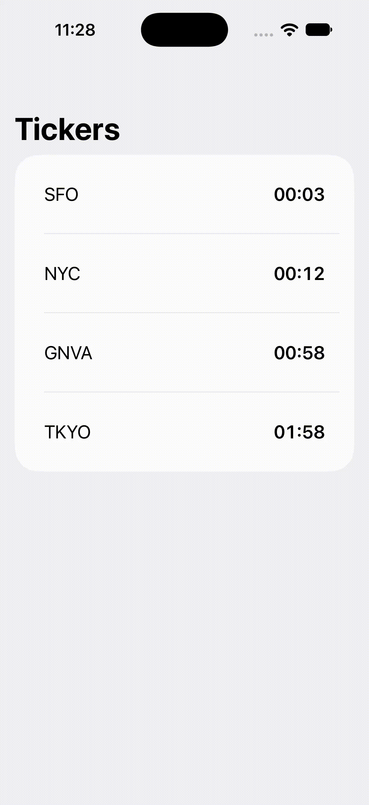

# Tickers

A small interview prep ticker app project that runs multiple timers written in SwiftUI.

## Notes
- SwiftUI components were purely done by hand.
- AI reliance: some view model vars/functions were generated by AI (sorting, and some models like TickerItem for handling timer's TimeInterval value
- Navigation routing is currently not being used (intentionally) for this project.
- Addition to keep project interesting is sorting each cell when a timer expires.

## Demo

## License

    Copyright 2026 Neftali Samarey

    Licensed under the Apache License, Version 2.0 (the "License");
    you may not use this file except in compliance with the License.
    You may obtain a copy of the License at

        http://www.apache.org/licenses/LICENSE-2.0

    Unless required by applicable law or agreed to in writing, software
    distributed under the License is distributed on an "AS IS" BASIS,
    WITHOUT WARRANTIES OR CONDITIONS OF ANY KIND, either express or implied.
    See the License for the specific language governing permissions and
    limitations under the License.
